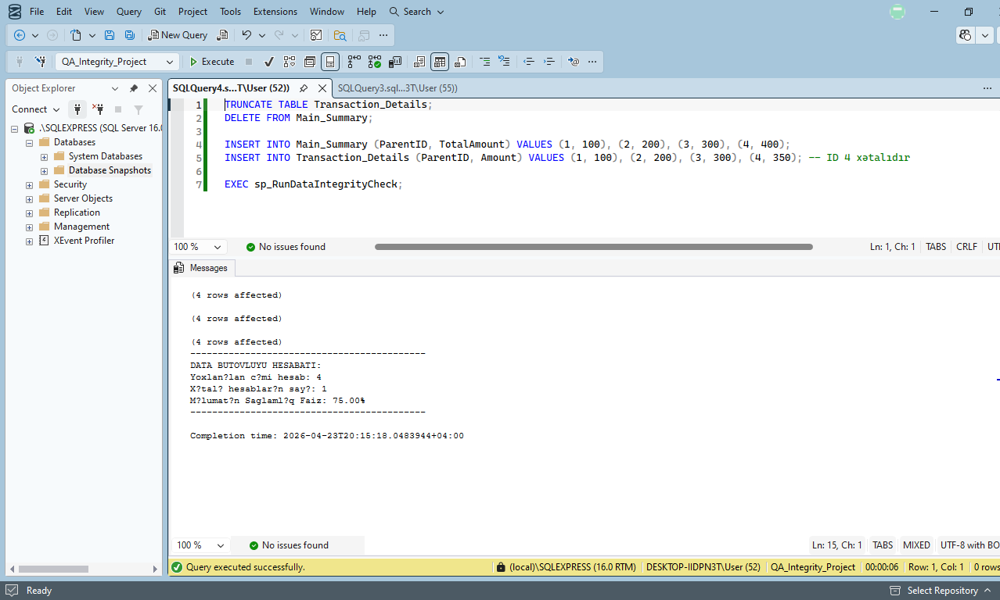

# Automated-SQL-Data-Reconciliation-Tool
Automated SQL stored procedure for data reconciliation between financial summary tables and transaction logs. Features automated issue logging and health percentage calculation

